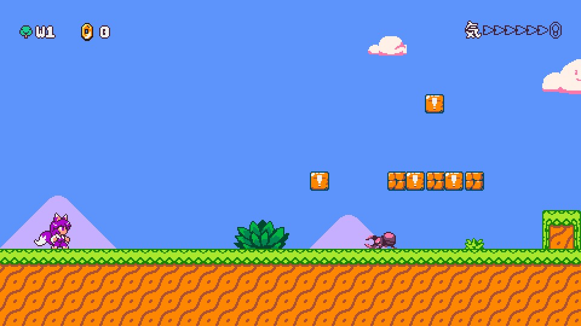

# Kitsune Tails: Super Kitsune Bros

An attempt at recreating [1-1](https://en.wikipedia.org/wiki/World_1-1) of [Super Mario Bros](https://en.wikipedia.org/wiki/Super_Mario_Bros) in [Kitsune Tails](https://kitsunegames.com/kitsunetails/).



## Installation

1. Download the folder to your `KitsuneTails/levels` folder, usually available at one of the following...
    ```
    AppData\Roaming\KitsuneTails\levels
    $XDG_DATA_HOME/KitsuneTails/levels
    ~/Library/Application Support/KitsuneTails/levels
    ~/.local/share/KitsuneTails/levels
    ```

2. Launch Kitsune Tails
3. Select Mods
4. Choose SuperKitsuneBros

## Development

1. Have [Node.js](https://nodejs.org/en) installed
1. Run `npm it` to set up the correct tileset paths
1. Open `SuperKitsuneBros.tiled-project` with [Tiled](https://www.mapeditor.org/)

### File Descriptions

| Filename | Description |
| -------- | ----------- |
| bg-bluesky.json | The background sky |
| level-1-1-begin.json | The opening screen for 1-1 |
| level-1-1-game.json | The gameplay level for 1-1 |
| level-1-1-underground.json | The underground stage for 1-1 |
| level.json | The opening welcome screen for the game |
| music-ground.ogg | Music for the game |
| music-underground.ogg | Music for the underground |
| tileset.png | Additional decoration tileset from the original game |
| objects.json | The Kitsune Tails original objects file |
| SuperKitsuneBros.tiled-project | Tiled project file |

## Resources

- https://nesmaps.com/maps/SuperMarioBrothers/SuperMarioBrothers.html
- https://downloads.khinsider.com/game-soundtracks/album/super-mario-bros
- https://fontstruct.com/fontstructions/show/1332355/arcade-classic-2-19

## License

[CC BY-NC-SA 4.0](https://creativecommons.org/licenses/by-nc-sa/4.0/).
